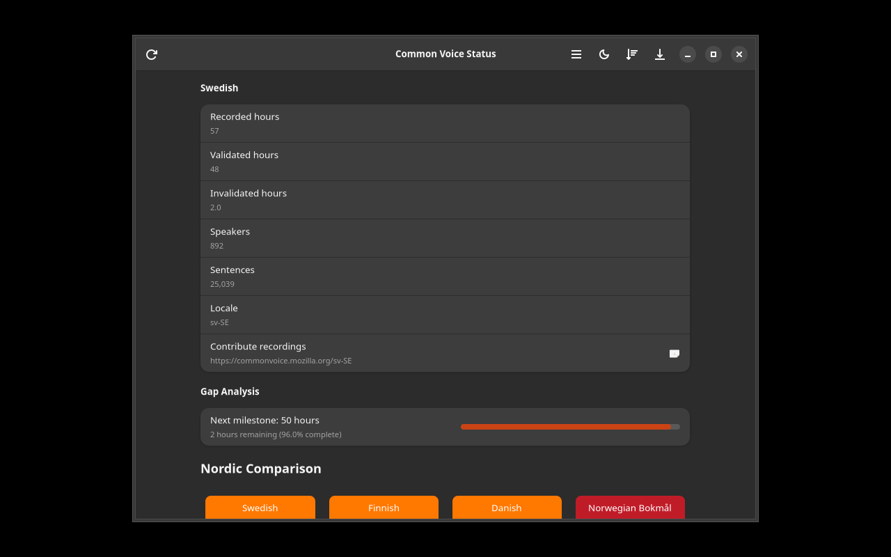
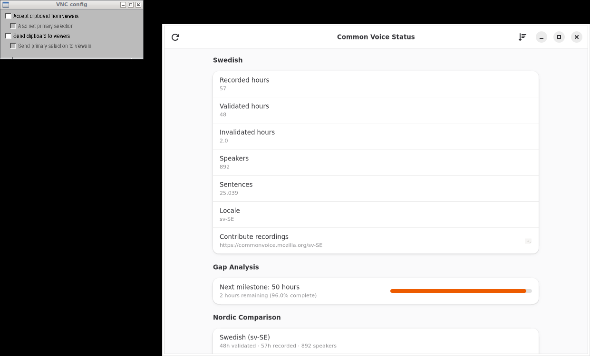

# Common Voice Status

## Screenshot



A GTK4/Adwaita application for viewing Mozilla Common Voice recording and validation statistics per language.



## Features

- View statistics per language: recorded hours, validated hours, speakers, sentences
- Compare Nordic languages (sv, no, da, fi) side by side
- Sort by most validated, most recorded, or most speakers
- Gap analysis — how much more is needed to reach the next milestone
- Direct link to contribute recordings on Common Voice
- Local cache with 1-hour TTL

## Installation

### Debian/Ubuntu

```bash
# Add repository
curl -fsSL https://yeager.github.io/debian-repo/KEY.gpg | sudo gpg --dearmor -o /usr/share/keyrings/yeager-archive-keyring.gpg
echo "deb [signed-by=/usr/share/keyrings/yeager-archive-keyring.gpg] https://yeager.github.io/debian-repo stable main" | sudo tee /etc/apt/sources.list.d/yeager.list
sudo apt update
sudo apt install commonvoice-status
```

### Fedora/RHEL

```bash
sudo dnf config-manager --add-repo https://yeager.github.io/rpm-repo/yeager.repo
sudo dnf install commonvoice-status
```

### From source

```bash
pip install .
commonvoice-status
```

## 🌍 Contributing Translations

This app is translated via Transifex. Help translate it into your language!

**[→ Translate on Transifex](https://app.transifex.com/danielnylander/commonvoice-status/)**

Currently supported: Swedish (sv). More languages welcome!

### For Translators
1. Create a free account at [Transifex](https://www.transifex.com)
2. Join the [danielnylander](https://app.transifex.com/danielnylander/) organization
3. Start translating!

Translations are automatically synced via GitHub Actions.

## License

GPL-3.0-or-later — Daniel Nylander <daniel@danielnylander.se>
